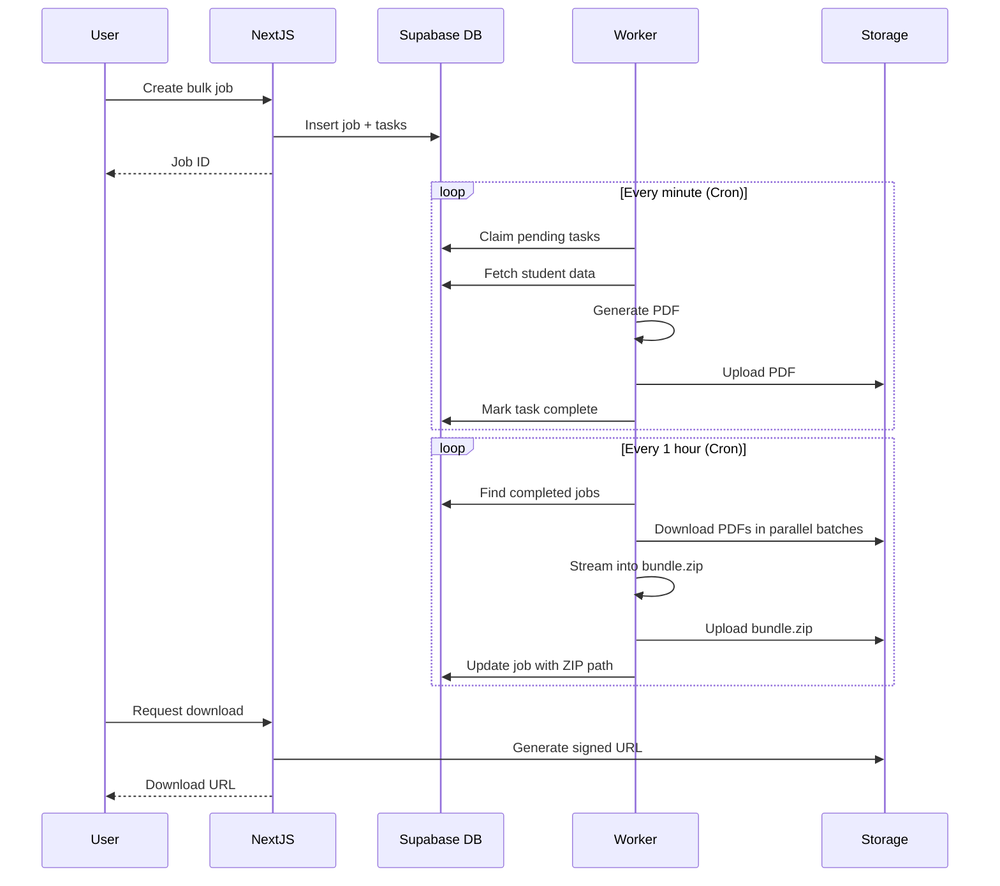

# Paquetes.sv - Sistema de Gestión de Tallas de Uniformes Escolares

Sistema completo para gestionar y reportar tallas de uniformes escolares en El Salvador. Construido con Next.js (App Router), TypeScript, Tailwind CSS y Supabase.

## Características

- **Consultas Ad-hoc**: Filtra estudiantes por escuela y grado, visualiza tallas en una tabla interactiva con paginación
- **Reportes Masivos**: Genera PDFs automáticamente para todas las escuelas y grados, descárgalos en un solo ZIP
- **Arquitectura Escalable**: Procesamiento asíncrono de tareas para manejar grandes volúmenes de datos sin timeouts
- **Listo para Autenticación**: Infraestructura preparada para integrar Supabase Auth cuando sea necesario

## Stack Tecnológico

- **Frontend**: Next.js 14 (App Router), React, TypeScript, Tailwind CSS
- **Backend**: Supabase (PostgreSQL + Storage + RPC Functions)
- **PDF Generation**: PDFKit (streaming para eficiencia de memoria)
- **Data Grid**: TanStack Table
- **Worker**: Vercel Cron o Supabase Edge Functions
- **ZIP Bundling**: Archiver

## Estructura del Proyecto

```
├── src/
│   ├── app/                      # Next.js App Router
│   │   ├── page.tsx              # Página de consultas ad-hoc
│   │   ├── bulk/                 # Páginas de reportes masivos
│   │   └── api/                  # API routes
│   │       ├── schools/          # Búsqueda de escuelas
│   │       ├── grades/           # Obtener grados
│   │       ├── students/         # Consultas de estudiantes
│   │       ├── bulk/             # Gestión de trabajos masivos
│   │       └── worker/           # Endpoints de procesamiento
│   ├── components/               # Componentes React
│   │   ├── ui/                   # Componentes UI base
│   │   ├── FiltersPanel.tsx      # Panel de filtros con autocomplete
│   │   ├── StudentsGrid.tsx      # Tabla de estudiantes
│   │   └── JobProgress.tsx       # Visualización de progreso
│   ├── lib/                      # Utilidades y clientes
│   │   ├── supabase/             # Clientes de Supabase
│   │   ├── pdf/                  # Generación de PDFs
│   │   ├── zip/                  # Creación de ZIPs
│   │   └── auth/                 # Middleware de auth (futuro)
│   └── types/                    # Definiciones TypeScript
├── supabase/
│   ├── migrations/               # Migraciones SQL
│   │   └── 001_add_reporting_tables.sql
│   └── functions/                # Edge Functions (opcional)
│       └── report-worker/
├── paquetes_schema.sql           # Schema base existente
└── fix_foreign_keys.sql          # Migración de FK existente
```

## Configuración e Instalación

### 1. Clonar y configurar el proyecto

```bash
git clone <repository-url>
cd paquetes.sv
npm install
```

### 2. Configurar Supabase

#### a) Crear proyecto en Supabase

- Ve a [supabase.com](https://supabase.com) y crea un nuevo proyecto
- Anota la URL y las API keys

#### b) Ejecutar migraciones

En el SQL Editor de Supabase, ejecuta en orden:

1. **Schema base** (si no existe):

   ```sql
   -- Ejecuta el contenido de paquetes_schema.sql
   ```

2. **Fix de foreign keys** (si es necesario):

   ```sql
   -- Ejecuta el contenido de fix_foreign_keys.sql
   ```

3. **Infraestructura de reportes**:
   ```sql
   -- Ejecuta el contenido de supabase/migrations/001_add_reporting_tables.sql
   ```

#### c) Configurar Storage

1. En el Dashboard de Supabase, ve a Storage
2. Crea un bucket llamado `reports`
3. Configura las políticas de acceso:

```sql
-- Permitir lectura pública (o ajusta según necesites)
CREATE POLICY "Allow public read access"
ON storage.objects FOR SELECT
USING (bucket_id = 'reports');

-- Permitir escritura desde service role
CREATE POLICY "Allow service role write"
ON storage.objects FOR INSERT
USING (bucket_id = 'reports');
```

### 3. Variables de Entorno

Copia `.env.example` a `.env`:

```bash
cp .env.example .env
```

Completa con tus credenciales de Supabase:

```env
NEXT_PUBLIC_SUPABASE_URL=https://tu-proyecto.supabase.co
NEXT_PUBLIC_SUPABASE_ANON_KEY=tu_anon_key
SUPABASE_SERVICE_ROLE_KEY=tu_service_role_key

# Genera un secret para workers:
SUPABASE_FUNCTION_SECRET=$(openssl rand -base64 32)
CRON_SECRET=$(openssl rand -base64 32)
```

### 4. Ejecutar en desarrollo

```bash
npm run dev
```

Abre [http://localhost:3000](http://localhost:3000)

## Despliegue

### Opción A: Vercel (Recomendado para Next.js)

1. **Deploy a Vercel**:

   ```bash
   vercel
   ```

2. **Configurar variables de entorno** en Vercel Dashboard

3. **Los cron jobs se configuran automáticamente** desde `vercel.json`:
   - `/api/worker/process-tasks` - Cada minuto (procesa PDFs)
   - `/api/worker/create-zip` - Cada 5 minutos (crea ZIPs)

### Opción B: Supabase Edge Functions

Si prefieres usar Supabase Edge Functions:

1. **Instalar CLI**:

   ```bash
   npm install -g supabase
   ```

2. **Deploy función**:

   ```bash
   supabase functions deploy report-worker
   ```

3. **Configurar secretos**:

   ```bash
   supabase secrets set NEXTJS_URL=https://tu-app.vercel.app
   supabase secrets set FUNCTION_SECRET=tu_secret
   ```

4. **Configurar cron** en Supabase:
   - Dashboard > Database > Cron Jobs
   - Ejecuta cada minuto: `SELECT net.http_post(...)`

## Uso

### Consultas Ad-hoc

1. Ve a la página principal
2. Busca una escuela (autocomplete)
3. Selecciona un grado (opcional)
4. Haz clic en "Buscar"
5. Navega por los resultados paginados

### Reportes Masivos

1. Ve a "Reportes Masivos"
2. Haz clic en "Generar Todos los PDFs"
3. Se crea un trabajo que:
   - Genera un PDF por cada combinación escuela-grado
   - Procesa en batches para evitar timeouts
   - Crea un ZIP cuando todos los PDFs están listos
4. Monitorea el progreso en tiempo real
5. Descarga el ZIP cuando esté completo

## Flujo de Procesamiento



## Arquitectura de Base de Datos

### Tablas Principales (Schema `edu`)

- **`schools`**: Información de escuelas (codigo_ce, nombre_ce, etc.)
- **`students`**: Estudiantes (nie, school_codigo_ce, grado, etc.)
- **`uniform_sizes`**: Tallas de uniformes (camisa, pantalon_falda, zapato)

### Tablas de Reportes (Schema `edu`)

- **`report_jobs`**: Trabajos de generación masiva
  - Estados: queued → running → complete/failed
  - Almacena `zip_path` cuando termina
- **`report_tasks`**: Tareas individuales (una por escuela+grado)
  - Estados: pending → running → complete/failed
  - Almacena `pdf_path` para cada PDF generado

### Funciones RPC

- `query_students()`: Consulta con filtros y paginación
- `search_schools()`: Autocomplete de escuelas
- `get_grades()`: Lista de grados únicos
- `report_students_by_school_grade()`: Datos listos para reporte
- `get_school_grade_combinations()`: Para crear trabajos masivos
- `claim_pending_tasks()`: Worker claim con SKIP LOCKED
- `update_task_status()`: Actualizar estado de tarea
- `get_job_progress()`: Estadísticas de progreso

## Mejoras Futuras

### Autenticación (Ya preparado)

El código incluye un "auth seam" listo para implementar:

1. **Descomentar funciones** en `src/lib/supabase/auth.ts`
2. **Activar middleware** en `src/middleware.ts`
3. **Habilitar RLS** en Supabase:

   ```sql
   ALTER TABLE public.report_jobs ENABLE ROW LEVEL SECURITY;
   ALTER TABLE public.report_tasks ENABLE ROW LEVEL SECURITY;

   -- Solo usuarios autenticados pueden crear trabajos
   CREATE POLICY "Authenticated users can insert jobs"
   ON public.report_jobs FOR INSERT
   TO authenticated
   WITH CHECK (true);
   ```

4. **Crear página de login** en `src/app/login/page.tsx`

### Otras Mejoras

- [ ] Filtros avanzados (rango de tallas, tallas faltantes)
- [ ] Exportar a Excel
- [ ] Notificaciones por email cuando terminen trabajos
- [ ] Dashboard con estadísticas
- [ ] Edición de datos de estudiantes
- [ ] Plantillas de PDF personalizables
- [ ] Retry automático de tareas fallidas
- [ ] Webhook para integración con otros sistemas

## Troubleshooting

### Los cron jobs no funcionan

- **Vercel**: Asegúrate de estar en un plan que soporte cron
- **Local**: Los cron no corren localmente, ejecuta manualmente:
  ```bash
  curl -X POST http://localhost:3000/api/worker/process-tasks \
    -H "Authorization: Bearer tu_secret"
  ```

### "Invalid schema" (PGRST106)

Este proyecto usa el schema **`public`** (default de Supabase). Si ves `Invalid schema`, es porque el cliente está forzando un schema no expuesto.

- Asegúrate de **no** configurar `db.schema` a un schema custom
  ```

  ```

### Errores de Storage

- Verifica que el bucket `reports` existe
- Revisa las políticas de acceso
- Confirma que `SUPABASE_SERVICE_ROLE_KEY` está configurado

### PDFs vacíos o corruptos

- Revisa los logs del worker
- Verifica que los datos existen en la base de datos
- Ejecuta la función RPC manualmente en Supabase SQL Editor

### Memoria insuficiente

- PDFKit genera streams para eficiencia
- Si aún tienes problemas, reduce `batchSize` en el worker
- Considera aumentar límites de memoria en Vercel

## Contribuir

1. Fork el repositorio
2. Crea una rama: `git checkout -b feature/mi-mejora`
3. Commit: `git commit -am 'Agrega nueva funcionalidad'`
4. Push: `git push origin feature/mi-mejora`
5. Crea un Pull Request

## Licencia

[Especificar licencia]

## Contacto

[Tu información de contacto]
