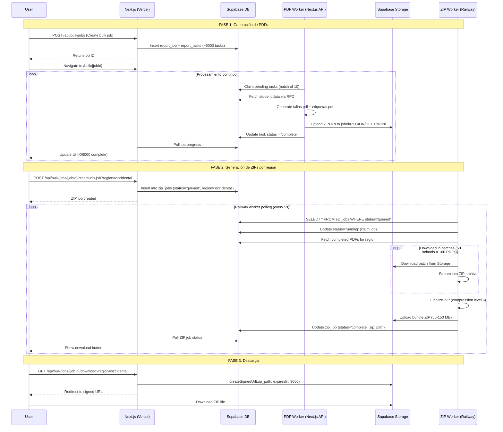

# Paquetes.sv - Sistema de Gestión de Tallas de Uniformes Escolares

[](https://nextjs.org/)
[](https://www.typescriptlang.org/)
[](https://supabase.com/)
[](https://railway.app/)
[](https://tailwindcss.com/)

Sistema completo para gestionar y reportar tallas de uniformes escolares en El Salvador. Construido con Next.js (App Router), TypeScript, Tailwind CSS, Supabase y Railway para procesamiento en background.

## Tabla de Contenidos

- [Características](#características)
- [Stack Tecnológico](#stack-tecnológico)
- [Estructura del Proyecto](#estructura-del-proyecto)
- [Configuración e Instalación](#configuración-e-instalación)
- [Despliegue](#despliegue)
  - [Frontend en Vercel](#paso-1-desplegar-frontend-en-vercel)
  - [Worker ZIP en Railway](#paso-2-desplegar-worker-zip-en-railway)
- [Uso](#uso)
  - [Consultas Ad-hoc](#consultas-ad-hoc-página-principal)
  - [Reportes Masivos](#reportes-masivos-módulo-bulk)
- [Arquitectura y Flujo](#arquitectura-y-flujo-de-procesamiento)
- [Decisiones Técnicas](#decisiones-técnicas-y-justificaciones)
- [Mejoras Futuras](#mejoras-futuras)
- [Troubleshooting](#troubleshooting)
- [Tecnologías Utilizadas](#tecnologías-utilizadas-resumen)
- [Performance y Escalabilidad](#performance-y-escalabilidad)
- [Seguridad](#seguridad)
- [Costos Estimados](#costos-estimados-mensual)
- [Contribuir](#contribuir)

---

## Características

- **Consultas Ad-hoc**: Filtra estudiantes por escuela y grado, visualiza tallas en una tabla interactiva con paginación y ordenamiento
- **Reportes Masivos**: Genera PDFs automáticamente para todas las escuelas organizados por región geográfica (Occidental, Central, Oriental)
- **Procesamiento Paralelo**: Worker dedicado en Railway para generación de ZIPs de alta capacidad sin límites de tiempo
- **Arquitectura Escalable**: Sistema de colas basado en PGMQ para procesamiento asíncrono de ~6,000+ PDFs por trabajo
- **Doble Tipo de PDF**: Genera tanto reportes de tallas como etiquetas de identificación para cada escuela
- **Storage Robusto**: Supabase Storage con políticas RLS optimizadas para uploads grandes y descarga pública

## Stack Tecnológico

### Frontend y Backend

- **Framework**: Next.js 14 (App Router) con React 18 y TypeScript 5
- **Estilos**: Tailwind CSS 3 con configuración personalizada
- **Base de Datos**: Supabase PostgreSQL con esquema `public`
- **Storage**: Supabase Storage (bucket `reports`) con soporte para archivos hasta 500MB
- **Funciones RPC**: Stored procedures para lógica compleja (búsqueda, reportes, colas)

### Generación de Documentos

- **PDFs**: PDFKit con streaming para eficiencia de memoria
- **ZIP Bundling**: Archiver con compresión configurable y procesamiento por batches
- **Worker Background**: Servicio Node.js independiente deployado en Railway

### Herramientas de Desarrollo

- **Linting**: ESLint + TypeScript ESLint con Prettier
- **Formateo**: Prettier con plugin de Tailwind CSS
- **Type Safety**: TypeScript strict mode + Zod para validación de datos
- **Data Grid**: TanStack Table v8 para tablas interactivas

### Infraestructura

- **Hosting Web**: Vercel (recomendado) o cualquier plataforma Node.js
- **Worker**: Railway con Dockerfile multi-stage para optimización
- **CI/CD**: Basado en Git con hot-reload configurado en Railway

## Estructura del Proyecto

```
paquetes.sv/
├── src/
│   ├── app/                        # Next.js App Router
│   │   ├── page.tsx                # Página de consultas ad-hoc
│   │   ├── layout.tsx              # Layout raíz con metadata
│   │   ├── bulk/                   # Módulo de reportes masivos
│   │   │   ├── page.tsx            # Lista de trabajos
│   │   │   └── [jobId]/            # Detalle de trabajo específico
│   │   │       └── page.tsx        # Progreso en tiempo real
│   │   └── api/                    # API Routes
│   │       ├── schools/search/     # Búsqueda con autocomplete
│   │       ├── grades/             # Lista de grados únicos
│   │       ├── students/           # Consultas y PDFs on-demand
│   │       │   ├── query/          # Query con filtros
│   │       │   ├── print/          # PDF de tallas
│   │       │   └── print-labels/   # PDF de etiquetas
│   │       ├── bulk/               # Gestión de trabajos masivos
│   │       │   ├── jobs/           # CRUD de jobs
│   │       │   ├── batches/        # Información de batches
│   │       │   └── tasks/          # Descargas de PDFs individuales
│   │       └── worker/             # Worker interno (Next.js)
│   │           └── process-tasks/  # Procesamiento de tareas PDF
│   ├── components/                 # Componentes React
│   │   ├── ui/                     # Sistema de diseño base
│   │   │   ├── Button.tsx
│   │   │   ├── Card.tsx
│   │   │   ├── Input.tsx
│   │   │   └── Select.tsx
│   │   ├── FiltersPanel.tsx        # Filtros con estado y validación
│   │   ├── StudentsGrid.tsx        # Tabla con TanStack Table
│   │   └── JobProgress.tsx         # Visualización de progreso por región
│   ├── lib/                        # Lógica de negocio
│   │   ├── supabase/               # Clientes de Supabase
│   │   │   ├── client.ts           # Cliente browser
│   │   │   ├── server.ts           # Cliente server-side
│   │   │   └── auth.ts             # Helpers de autenticación (futuro)
│   │   ├── pdf/
│   │   │   └── generator.ts        # Generación PDFs con PDFKit
│   │   ├── storage/
│   │   │   └── keys.ts             # Utilidades para paths de storage
│   │   └── auth/
│   │       └── middleware.ts       # Auth middleware (preparado)
│   └── types/                      # Definiciones TypeScript
│
├── worker/                         # Worker independiente para ZIP
│   └── zip-worker/
│       ├── index.ts                # Loop principal del worker
│       ├── package.json            # Dependencias aisladas
│       ├── tsconfig.json           # Configuración TS
│       ├── railway.json            # Config específica de Railway
│       └── Dockerfile              # Build multi-stage optimizado
│
├── supabase/
│   ├── migrations/                 # 29+ migraciones SQL
│   │   ├── 001_add_reporting_tables.sql
│   │   ├── 017_add_pgmq_queues_and_work_results.sql
│   │   ├── 024_add_zip_jobs_queue.sql
│   │   ├── 029_fix_storage_rls_definitive.sql
│   │   └── ...                     # Optimizaciones incrementales
│   └── setup-storage.sql           # Configuración inicial de bucket
│
├── scripts/                        # Scripts de utilidad
│
├── Dockerfile.worker               # Dockerfile para Railway (root context)
├── railway.toml                    # Configuración de Railway
├── paquetes_schema.sql             # Schema base edu.*
├── fix_foreign_keys.sql            # Fix de referencias FK
├── next.config.js                  # Config Next.js (PDFKit bundling)
├── tailwind.config.ts              # Theme personalizado
├── tsconfig.json                   # Config TypeScript
└── .env                            # Variables de entorno
```

## Configuración e Instalación

### 1. Clonar y configurar el proyecto

```bash
git clone <repository-url>
cd paquetes.sv
npm install
```

### 2. Configurar Supabase

#### a) Crear proyecto en Supabase

1. Ve a [supabase.com](https://supabase.com) y crea un nuevo proyecto
2. Espera a que el proyecto se provisione (~2 minutos)
3. Ve a **Settings → API** y copia:
   - Project URL
   - `anon` `public` key
   - `service_role` key (¡mantén esto secreto!)

#### b) Ejecutar migraciones

En el SQL Editor de Supabase, ejecuta **en orden**:

1. **Schema base de educación** (si no existe):

   ```bash
   # En SQL Editor, pega y ejecuta:
   paquetes_schema.sql
   ```

2. **Fix de foreign keys**:

   ```bash
   fix_foreign_keys.sql
   ```

3. **Todas las migraciones de reportes** (en orden numérico):

   ```bash
   # Ejecuta cada archivo en supabase/migrations/ desde 001 hasta 029
   # O concatena todos y ejecuta de una vez (¡cuidado con errores!)
   ```

   **Migraciones clave**:
   - `001`: Tablas `report_jobs`, `report_tasks`
   - `017`: PGMQ queues + `report_work_results`
   - `024`: Cola de trabajos ZIP
   - `029`: Fix definitivo de políticas RLS para Storage

#### c) Configurar Storage

El bucket `reports` se crea automáticamente al ejecutar la migración `029`, pero puedes verificarlo:

1. Ve a **Storage** en el Dashboard de Supabase
2. Verifica que existe el bucket `reports` con:
   - **Public**: Sí (permite descargas públicas con URL firmada)
   - **File size limit**: 500 MB
   - **Allowed MIME types**: `application/pdf`, `application/zip`

3. **Políticas RLS** (migración 029 las crea automáticamente):

   ```sql
   -- Lectura pública
   CREATE POLICY "reports_bucket_public_read"
   ON storage.objects FOR SELECT
   USING (bucket_id = 'reports');

   -- Service role puede todo
   CREATE POLICY "reports_bucket_service_role_all"
   ON storage.objects FOR ALL TO service_role
   USING (bucket_id = 'reports')
   WITH CHECK (bucket_id = 'reports');

   -- Autenticados pueden escribir (fallback)
   CREATE POLICY "reports_bucket_authenticated_write"
   ON storage.objects FOR ALL TO authenticated
   USING (bucket_id = 'reports')
   WITH CHECK (bucket_id = 'reports');
   ```

**Nota sobre Storage RLS**: La migración 029 resuelve problemas comunes de permisos al eliminar todas las políticas conflictivas y crear un conjunto limpio. Si aún tienes problemas de upload, verifica que usas el `service_role` key correcto.

### 3. Variables de Entorno

Copia `.env.example` a `.env`:

```bash
cp .env.example .env
```

Completa con tus credenciales de Supabase:

```env
NEXT_PUBLIC_SUPABASE_URL=https://tu-proyecto.supabase.co
NEXT_PUBLIC_SUPABASE_ANON_KEY=tu_anon_key
SUPABASE_SERVICE_ROLE_KEY=tu_service_role_key

# Genera un secret para workers:
SUPABASE_FUNCTION_SECRET=$(openssl rand -base64 32)
CRON_SECRET=$(openssl rand -base64 32)
```

### 4. Ejecutar en desarrollo

```bash
npm run dev
```

Abre [http://localhost:3000](http://localhost:3000)

## Despliegue

Este proyecto usa una arquitectura híbrida:

- **Frontend/API**: Vercel (o cualquier plataforma Node.js)
- **Worker ZIP**: Railway (proceso persistente)

### Paso 1: Desplegar Frontend en Vercel

1. **Push a GitHub** (si no lo has hecho):

   ```bash
   git push origin main
   ```

2. **Importar en Vercel**:
   - Ve a [vercel.com](https://vercel.com) y conecta tu repositorio
   - Vercel detecta automáticamente Next.js

3. **Configurar variables de entorno** en Vercel Dashboard:

   ```env
   NEXT_PUBLIC_SUPABASE_URL=https://tu-proyecto.supabase.co
   NEXT_PUBLIC_SUPABASE_ANON_KEY=eyJhbGci...
   SUPABASE_SERVICE_ROLE_KEY=eyJhbGci...
   CRON_SECRET=tu_random_secret
   ```

4. **Deploy**:
   - Vercel construye y despliega automáticamente
   - El worker interno (`/api/worker/process-tasks`) genera PDFs bajo demanda

**Nota**: Los cron jobs de Vercel requieren un plan Pro. Para desarrollo, invoca manualmente los endpoints.

### Paso 2: Desplegar Worker ZIP en Railway

El worker ZIP es un servicio Node.js independiente que procesa ZIPs en background.

#### ¿Por qué Railway?

- **Procesos persistentes**: A diferencia de funciones serverless, Railway corre 24/7
- **Sin límites de tiempo**: Generación de ZIPs puede tomar 5-10 minutos
- **Uso eficiente de recursos**: Polling con intervalos configurables
- **Logs en tiempo real**: Monitoreo completo del worker

#### Configuración en Railway

1. **Crear cuenta en [Railway](https://railway.app)**

2. **Nuevo proyecto desde GitHub**:
   - Conecta tu repositorio
   - Railway detecta el `railway.toml` y `Dockerfile.worker`

3. **Configurar variables de entorno** en Railway:

   ```env
   NEXT_PUBLIC_SUPABASE_URL=https://tu-proyecto.supabase.co
   SUPABASE_SERVICE_ROLE_KEY=eyJhbGci...
   POLL_INTERVAL_MS=5000          # Polling cada 5 segundos
   DOWNLOAD_BATCH_SIZE=50         # PDFs por batch
   COMPRESSION_LEVEL=6            # Nivel de compresión (1-9)
   ```

4. **Railway deployment**:
   - Railway construye usando `Dockerfile.worker` (multi-stage build)
   - El servicio inicia automáticamente y comienza a hacer polling
   - Ve logs en tiempo real en Railway Dashboard

5. **Verificar deployment**:
   ```bash
   # En los logs de Railway deberías ver:
   🚀 ZIP Worker starting...
   📊 Config: Poll interval=5000ms, Batch size=50, Compression=6
   ```

#### Arquitectura del Worker ZIP

El worker de Railway opera de forma independiente:

1. **Polling**: Consulta la base de datos cada 5 segundos buscando trabajos ZIP pendientes
2. **Claim**: Reclama un trabajo usando `claim_next_zip_job()` (evita conflictos)
3. **Procesamiento**:
   - Descarga PDFs de Supabase Storage en batches
   - Crea archivo ZIP en memoria con streaming
   - Sube ZIP a Supabase Storage (TUS automático para archivos grandes)
4. **Actualización**: Marca el trabajo como `complete` con la ruta del ZIP

**Ventajas de esta arquitectura**:

- Frontend puede seguir respondiendo sin esperar
- ZIPs de 100+ MB se procesan sin timeouts
- Fácil escalar horizontalmente (múltiples replicas en Railway)
- Separación de concerns (Next.js API vs worker background)

### Alternativa: Supabase Edge Functions

Si prefieres no usar Railway, puedes adaptar el worker como Edge Function:

1. **Instalar CLI de Supabase**:

   ```bash
   npm install -g supabase
   ```

2. **Adaptar código** del worker a Deno (Edge Functions usan Deno, no Node)

3. **Deploy**:
   ```bash
   supabase functions deploy zip-worker
   ```

**Limitaciones de Edge Functions**:

- Límite de tiempo de ejecución (generalmente 60-120s)
- No hay polling continuo (necesitas triggers o cron externos)
- Más complejo para debugging

Por eso recomendamos Railway para el worker ZIP.

## Uso

### Consultas Ad-hoc (Página Principal)

1. **Búsqueda de escuela**: Usa el campo de autocomplete para buscar por código o nombre
2. **Selección de grado**: Opcional - filtra por grado específico
3. **Visualización**: Tabla interactiva con:
   - Ordenamiento por columna
   - Paginación (50 registros por página)
   - Datos: NIE, nombre, sexo, grado, tallas (camisa, pantalón/falda, zapato)
4. **Impresión rápida**:
   - **"Imprimir Tallas"**: Genera PDF con tabla de tallas
   - **"Imprimir Etiquetas"**: Genera PDF con etiquetas de identificación

### Reportes Masivos (Módulo Bulk)

Este módulo genera PDFs para **todas** las escuelas del país, organizados por región.

#### Flujo completo

1. **Iniciar generación**:
   - Ve a `/bulk`
   - Clic en **"Generar Todos los PDFs"**
   - Se crea un trabajo (`report_job`) con estado `queued`

2. **Generación de PDFs** (automática):
   - El worker interno (`/api/worker/process-tasks`) procesa las tareas
   - Genera 2 PDFs por escuela:
     - `{codigo_ce}-tallas.pdf`: Reporte de tallas
     - `{codigo_ce}-etiquetas.pdf`: Etiquetas imprimibles
   - PDFs se organizan por región → departamento → municipio
   - Progreso visible en tiempo real en `/bulk/[jobId]`

3. **Generación de ZIPs por región**:
   - Una vez completados los PDFs, aparecen botones por región (Occidental, Central, Oriental)
   - Clic en **"Generar ZIP"** para la región deseada
   - Se crea un trabajo ZIP (`zip_jobs`) con estado `queued`

4. **Procesamiento en Railway**:
   - El worker de Railway detecta el trabajo ZIP
   - Descarga PDFs de esa región en batches de 50
   - Crea ZIP con estructura: `DEPARTAMENTO/MUNICIPIO/12345-tallas.pdf`
   - Sube ZIP a Supabase Storage (puede ser 100+ MB)
   - Marca trabajo como `complete`

5. **Descarga**:
   - Botón de descarga aparece cuando el ZIP está listo
   - URL firmada de Supabase Storage con expiración de 1 hora

#### Monitoreo de progreso

En la página de detalle (`/bulk/[jobId]`) verás:

- **Estado general**: queued → running → complete
- **Progreso por región**: Contador de PDFs completados vs totales
- **Tareas fallidas**: Lista de errores con opción de retry
- **Botones de ZIP**: Aparecen cuando los PDFs de esa región están listos
- **Estado de ZIP**: queued → running → complete con indicador de progreso

## Arquitectura y Flujo de Procesamiento

### Diagrama de Flujo



### Componentes Clave

#### 1. Base de Datos (Supabase PostgreSQL)

**Tablas principales**:

- `schools`: Catálogo de escuelas (codigo_ce, nombre, región, departamento, municipio)
- `students`: Estudiantes con tallas (nie, school_codigo_ce, grado_ok, sexo)
- `uniform_sizes`: Tallas de uniforme por estudiante (camisa, pantalon_falda, zapato)
- `report_jobs`: Trabajos de generación masiva (id, batch_id, status, created_at)
- `report_tasks`: Tareas individuales (id, job_id, school_codigo_ce, status, pdf_path)
- `zip_jobs`: Trabajos de generación de ZIP (id, report_job_id, region, status, zip_path)

**Funciones RPC críticas**:

- `search_schools(query)`: Búsqueda con autocomplete (prioriza código CE)
- `query_students(school_codigo, grado, limit, offset)`: Paginación con ordenamiento
- `report_students_by_school_grade()`: Datos optimizados para PDFs
- `claim_pending_tasks(batch_size)`: Reclamo atómico con SKIP LOCKED
- `claim_next_zip_job()`: Reclamo atómico de trabajo ZIP
- `update_zip_job_status()`: Actualización de estado y metadata

#### 2. Storage (Supabase Storage)

**Bucket**: `reports` (público con RLS)

- **Límite de archivo**: 500 MB
- **MIME types permitidos**: `application/pdf`, `application/zip`
- **Estructura de carpetas**:
  ```
  reports/
  ├── {jobId}/
  │   ├── OCCIDENTAL/
  │   │   ├── AHUACHAPAN/
  │   │   │   ├── AHUACHAPAN/
  │   │   │   │   ├── 10001-tallas.pdf
  │   │   │   │   ├── 10001-etiquetas.pdf
  │   │   │   │   ├── 10002-tallas.pdf
  │   │   │   │   └── 10002-etiquetas.pdf
  │   │   ├── SANTA_ANA/
  │   │   └── SONSONATE/
  │   ├── CENTRAL/
  │   └── ORIENTAL/
  └── bundles/
      ├── {jobId}-occidental.zip
      ├── {jobId}-central.zip
      └── {jobId}-oriental.zip
  ```

**Políticas RLS** (migración 029):

- Lectura pública sin autenticación
- Escritura exclusiva para `service_role` y `authenticated`
- Bypass RLS para service role (usado por workers)

#### 3. Worker de PDFs (Next.js API Route)

**Ubicación**: `src/app/api/worker/process-tasks/route.ts`

**Características**:

- Ejecuta en Vercel (serverless)
- Timeout: 60s (con extensiones hasta 5 min en planes Pro)
- Procesa 10 tareas por invocación
- Genera PDFs con PDFKit en streaming
- Sube a Storage con service role key

**¿Por qué dentro de Next.js?**

- Reutiliza tipos y utilidades del proyecto
- Fácil desarrollo y testing local
- Serverless = no pagar por tiempo idle
- Ideal para tareas cortas (generar 1 PDF = 2-5s)

#### 4. Worker de ZIP (Railway Service)

**Ubicación**: `worker/zip-worker/index.ts`

**Características**:

- Proceso persistente (24/7)
- Sin límites de tiempo de ejecución
- Polling cada 5 segundos
- Procesa archivos grandes (100+ MB)
- Streaming de PDFs a ZIP para eficiencia de memoria

**¿Por qué en Railway?**

- Generación de ZIP puede tomar 5-15 minutos
- Necesita polling continuo (no eventos)
- Vercel serverless tiene timeout de 60s (5 min en Pro)
- Railway = $5/mes para workloads continuas vs Vercel Pro = $20/mes

**Dockerfile multi-stage**:

1. **Builder**: Instala deps, compila TypeScript
2. **Production**: Solo runtime + dependencies, usuario non-root

## Decisiones Técnicas y Justificaciones

### ¿Por qué Next.js 14 con App Router?

**Ventajas**:

- **Server Components**: Reducen JavaScript enviado al cliente (mejor performance)
- **Streaming**: Renderizado progresivo para UIs complejas
- **API Routes**: Backend y frontend en un solo proyecto
- **TypeScript first-class**: Excelente DX con autocompletado
- **Vercel deployment**: Deploy en 1 minuto con optimizaciones automáticas

**Alternativas consideradas**:

- **Remix**: Más opinado, menor ecosistema
- **SvelteKit**: Menos maduro para apps enterprise
- **SPA (React + Express)**: Más boilerplate, peor SEO

### ¿Por qué Supabase?

**Ventajas**:

- **PostgreSQL completo**: No limitaciones de Firebase/NoSQL
- **RLS (Row Level Security)**: Seguridad a nivel de base de datos
- **Storage integrado**: Sin necesidad de S3/Cloudflare
- **Funciones RPC**: Lógica compleja en DB (mejor performance)
- **Realtime**: Soporte para subscriptions (futuro)
- **Precios**: Free tier generoso, pay-as-you-grow

**Alternativas consideradas**:

- **Planetscale**: No tiene storage ni auth integrados
- **Firebase**: Firestore no es ideal para datos relacionales complejos
- **AWS RDS + S3**: Mayor complejidad operacional

### ¿Por qué PDFKit?

**Ventajas**:

- **Streaming**: Genera PDFs sin cargar todo en memoria
- **Control total**: Layout customizado (tablas, etiquetas, fuentes)
- **Node.js nativo**: Funciona en Vercel sin problemas
- **Sin dependencies pesadas**: Bundle pequeño (~500KB)

**Alternativas consideradas**:

- **Puppeteer/Playwright**: Requiere Chrome headless (pesado en serverless)
- **React-PDF**: Rendering más lento, mayor memoria
- **jsPDF**: Menos features, API menos intuitiva

### ¿Por qué Railway para el worker ZIP?

**Ventajas**:

- **Procesos persistentes**: Ideal para polling continuo
- **Sin timeouts**: Generación de ZIPs puede tomar 10+ minutos
- **Logs en tiempo real**: Debugging fácil
- **Dockerfile support**: Control total del runtime
- **Precio**: $5/mes vs Vercel Pro $20/mes (para workers)

**Alternativas consideradas**:

- **Vercel Cron (Pro)**: Timeout de 5 min, más caro
- **Supabase Edge Functions**: Límite de 120s, runtime Deno (no Node)
- **AWS Lambda**: Timeout de 15 min, pero más complejo de configurar
- **Render**: Similar a Railway, pero menos DX

### ¿Por qué Archiver para ZIPs?

**Ventajas**:

- **Streaming**: Crea ZIPs sin cargar todo en memoria
- **Compresión configurable**: Balance entre tamaño y velocidad
- **API simple**: Append files con rutas relativas
- **Estable**: Librería madura (8+ años)

**Alternativas consideradas**:

- **JSZip**: Carga todo en memoria (no escala para 100+ MB)
- **ADM-ZIP**: Similar a JSZip, no streaming
- **yazl**: Más bajo nivel, menos conveniente

### ¿Por qué TanStack Table?

**Ventajas**:

- **Headless**: Control total del markup (integra con Tailwind)
- **Performance**: Virtualización incluida para 10,000+ filas
- **Features completos**: Sorting, filtering, pagination out-of-the-box
- **TypeScript**: Type-safe columns y data

**Alternativas consideradas**:

- **AG Grid**: Demasiado complejo para este use case
- **React Table v7**: TanStack es la evolución oficial
- **Material Table**: Coupled a Material-UI (no queremos eso)

### ¿Por qué PGMQ (PostgreSQL Message Queue)?

**Nota**: PGMQ se configuró en migración 017 pero **no se usa activamente** en la implementación actual. Se mantiene para escalabilidad futura.

**Ventajas si se activa**:

- **Sin infraestructura extra**: Queue dentro de Postgres
- **ACID guarantees**: Transaccionalidad completa
- **Idempotency**: Deduplicación con `dedupe_key`
- **Visibility timeout**: Evita duplicados con workers concurrentes

**Sistema actual** (polling simple):

- Más sencillo de entender y debuggear
- Suficiente para volúmenes actuales (~6k PDFs/run)
- PGMQ activable sin cambios en DB schema

### ¿Por qué organizar por regiones geográficas?

**Ventajas**:

- **ZIPs más pequeños**: Occidental (~2k escuelas), Central (~2.5k), Oriental (~1.5k)
- **Descargas más rápidas**: Usuario solo descarga su región de interés
- **Paralelización**: 3 ZIPs se pueden generar concurrentemente
- **Mejor UX**: Progreso granular por región

**Estructura geográfica**:

```
El Salvador
├── OCCIDENTAL (Ahuachapán, Santa Ana, Sonsonate)
├── CENTRAL (La Libertad, San Salvador, Cuscatlán, La Paz, Cabañas, San Vicente)
└── ORIENTAL (Usulután, San Miguel, Morazán, La Unión)
```

## Mejoras Futuras

### Corto Plazo (1-3 meses)

#### 1. Autenticación y Autorización

**Estado**: Infraestructura ya preparada en el código

**Tareas**:

- [ ] Activar Supabase Auth (email/password + Google OAuth)
- [ ] Descomentar funciones en [src/lib/supabase/auth.ts](src/lib/supabase/auth.ts)
- [ ] Activar middleware en `src/middleware.ts`
- [ ] Habilitar RLS en tablas `report_jobs`, `report_tasks`, `zip_jobs`
- [ ] Crear roles: admin (CRUD completo), viewer (solo lectura), regional_admin (solo su región)
- [ ] Página de login/registro en `src/app/login/page.tsx`

**Justificación**: Control de acceso necesario para producción. Actualmente todo es público.

#### 2. Notificaciones

**Tareas**:

- [ ] Integrar Resend o SendGrid para emails
- [ ] Enviar notificación cuando un job completa
- [ ] Incluir enlaces de descarga en el email
- [ ] Opción de notificaciones push via Supabase Realtime

**Justificación**: Los ZIPs pueden tomar 10-15 minutos. Mejor UX si el usuario recibe notificación.

#### 3. Retry Automático de Tareas Fallidas

**Estado**: Ya existe migración 020 con función `retry_failed_tasks()`

**Tareas**:

- [ ] Crear endpoint `/api/bulk/jobs/[jobId]/retry-failed`
- [ ] Botón en UI para retry manual
- [ ] Cron job para retry automático después de N minutos
- [ ] Límite máximo de reintentos (evitar loops infinitos)

**Justificación**: Algunos PDFs pueden fallar por errores transitorios (network, storage). Retry automático mejora robustez.

### Mediano Plazo (3-6 meses)

#### 4. Activar PGMQ para Procesamiento de PDFs

**Estado**: PGMQ configurado en migración 017 pero no activo

**Tareas**:

- [ ] Reemplazar polling simple con PGMQ en PDF worker
- [ ] Migrar de `claim_pending_tasks()` a `pgmq.read('pdf_generate')`
- [ ] Implementar idempotency con `report_work_results`
- [ ] Edge Function workers paralelos (escalar a 10+ workers concurrentes)

**Justificación**: Actualmente 6k PDFs toman ~2-3 horas. Con PGMQ + workers paralelos = ~20-30 minutos.

**Trade-off**: Mayor complejidad vs mejor performance. Solo justificable si el volumen crece.

#### 5. Dashboard de Estadísticas

**Tareas**:

- [ ] Página `/dashboard` con métricas agregadas:
  - Estudiantes totales por región/departamento/municipio
  - Distribución de tallas (gráficos)
  - Historial de trabajos (últimos 30 días)
  - Tiempo promedio de generación
- [ ] Integrar Recharts o Chart.js
- [ ] Cache con React Query + Supabase Realtime

**Justificación**: Visibilidad del sistema. Útil para administradores y tomadores de decisión.

#### 6. Exportar a Excel

**Tareas**:

- [ ] Integrar ExcelJS o SheetJS
- [ ] Endpoint `/api/students/export` que genera XLSX
- [ ] Opción en UI: "Exportar a Excel" junto a "Imprimir"
- [ ] Incluir metadata (fecha generación, filtros aplicados)

**Justificación**: Muchos usuarios prefieren Excel para análisis posteriores. Complementa PDFs.

### Largo Plazo (6-12 meses)

#### 7. Edición de Datos de Estudiantes

**Tareas**:

- [ ] CRUD completo para estudiantes (con permisos)
- [ ] Validación de NIE (formato, unicidad)
- [ ] Auditoría: log de cambios (quién, cuándo, qué)
- [ ] Importación masiva desde CSV/Excel
- [ ] Integración con sistemas ministeriales (si aplica)

**Justificación**: Actualmente los datos son read-only. Para ser sistema completo, necesita CRUD.

**Trade-off**: Aumenta complejidad. Requiere autenticación robusta y auditoría.

#### 8. Plantillas de PDF Personalizables

**Tareas**:

- [ ] UI para diseñar plantillas (drag-and-drop o código)
- [ ] Almacenar plantillas en DB (tabla `pdf_templates`)
- [ ] Motor de templating (Handlebars o similar)
- [ ] Previsualización antes de generar masivamente

**Justificación**: Diferentes instituciones pueden necesitar layouts distintos (logos, colores, campos extra).

**Trade-off**: Feature complejo. Solo justificable si hay múltiples clientes/instituciones.

#### 9. Webhooks para Integración

**Tareas**:

- [ ] Tabla `webhooks` (url, eventos, secret)
- [ ] Disparar webhook cuando job completa
- [ ] Payload firmado con HMAC para seguridad
- [ ] Retry con backoff exponencial si webhook falla
- [ ] UI para configurar webhooks

**Justificación**: Permitir integración con otros sistemas (ERPs, SIGAs, etc.) sin polling.

#### 10. Migrar Worker ZIP a Edge Functions (opcional)

**Condición**: Si Supabase aumenta límites de timeout o Railway se vuelve muy caro

**Tareas**:

- [ ] Portar worker de Node.js a Deno
- [ ] Implementar chunking (dividir ZIPs grandes en partes)
- [ ] Subir partes en paralelo
- [ ] Endpoint para recombinar partes del lado del cliente

**Trade-off**: Mayor complejidad del código, pero elimina costo de Railway.

### Optimizaciones de Performance

#### 11. Cache de Consultas Frecuentes

**Tareas**:

- [ ] Implementar cache con Redis o Upstash
- [ ] Cachear resultados de `search_schools()`, `get_grades()`
- [ ] TTL configurable (ej: 1 hora)
- [ ] Invalidación manual desde admin UI

**Justificación**: Búsquedas escolares son repetitivas. Cache reduce latencia y carga en DB.

#### 12. Compresión de PDFs

**Tareas**:

- [ ] Integrar Ghostscript o similar para post-procesamiento
- [ ] Comprimir PDFs después de generarlos (puede reducir 30-50% tamaño)
- [ ] Trade-off: CPU extra vs ancho de banda

**Justificación**: ZIPs más pequeños = descargas más rápidas. Especialmente útil para regiones con internet lento.

#### 13. Virtualización de Tabla con TanStack Virtual

**Estado**: TanStack Table ya instalado, Virtual es add-on

**Tareas**:

- [ ] Integrar `@tanstack/react-virtual`
- [ ] Renderizar solo filas visibles en viewport
- [ ] Útil si se muestran 1000+ estudiantes de una escuela grande

**Justificación**: Mejor performance para tablas muy grandes. Actualmente con paginación de 50 no es crítico.

---

### Roadmap Priorizado

**P0 (Bloqueantes para producción)**:

1. Autenticación y autorización
2. Notificaciones por email
3. Retry automático de tareas fallidas

**P1 (Mejoran significativamente UX)**: 4. Dashboard de estadísticas 5. Exportar a Excel 6. Cache de consultas

**P2 (Nice-to-have)**: 7. Edición de datos 8. Plantillas personalizables 9. Webhooks

**P3 (Optimizaciones avanzadas)**: 10. Activar PGMQ 11. Migrar a Edge Functions 12. Compresión de PDFs 13. Virtualización de tabla

## Troubleshooting

### Errores de Storage: "new row violates row-level security policy"

**Síntoma**: El worker falla al subir PDFs con error RLS

**Causas**:

1. No estás usando el `service_role` key (usas `anon` key por error)
2. Las políticas RLS no están configuradas correctamente
3. El service role key es inválido

**Solución**:

1. Verifica que usas `SUPABASE_SERVICE_ROLE_KEY` en el worker (NO `ANON_KEY`)
2. Ejecuta la migración 029 (`fix_storage_rls_definitive.sql`)
3. Confirma las políticas en SQL Editor:
   ```sql
   SELECT policyname, roles, cmd
   FROM pg_policies
   WHERE schemaname = 'storage' AND tablename = 'objects';
   ```
4. Como último recurso, desactiva RLS temporalmente (NO recomendado en producción):
   ```sql
   ALTER TABLE storage.objects DISABLE ROW LEVEL SECURITY;
   ```

### Worker ZIP no procesa trabajos

**Síntoma**: Trabajos quedan en estado `queued` indefinidamente

**Diagnóstico**:

1. Verifica que Railway está corriendo:
   - Ve a Railway Dashboard → Logs
   - Deberías ver: `🚀 ZIP Worker starting...`

2. Revisa variables de entorno en Railway:
   - `NEXT_PUBLIC_SUPABASE_URL` (debe empezar con https://)
   - `SUPABASE_SERVICE_ROLE_KEY` (debe empezar con eyJ)

3. Verifica que hay trabajos pendientes en DB:

   ```sql
   SELECT * FROM zip_jobs WHERE status = 'queued';
   ```

4. Revisa logs del worker por errores específicos

**Solución común**: Railway se durmió (free tier). Escala a plan de pago o haz deploy para despertar.

### PDFs vacíos o corruptos

**Síntoma**: PDF se descarga pero no abre o está vacío

**Causas**:

1. No hay estudiantes para esa escuela/grado
2. Error en generación con PDFKit
3. Corrupción durante upload

**Diagnóstico**:

1. Verifica datos en DB:

   ```sql
   SELECT COUNT(*)
   FROM students s
   JOIN uniform_sizes us ON s.id = us.student_id
   WHERE s.school_codigo_ce = '10001';
   ```

2. Revisa logs del worker PDF:

   ```bash
   # Vercel: Dashboard → Functions → Logs
   # Local: Terminal donde corre `npm run dev`
   ```

3. Descarga el PDF desde Storage y ábrelo directamente (bypass del app):
   ```
   https://{project}.supabase.co/storage/v1/object/public/reports/{path}
   ```

**Solución**: Si no hay datos, el PDF estará vacío (comportamiento esperado). Agrega datos o filtra escuelas sin estudiantes.

### "Invalid schema" (PGRST106)

**Síntoma**: Error al llamar RPCs desde cliente

**Causa**: El schema `edu` no está expuesto en Supabase API

**Solución**:

1. Ve a Supabase Dashboard → Settings → API → Schema
2. Asegúrate que el schema expuesto es `public` (default)
3. Las funciones RPC deben estar en `public`, no en `edu`
4. Si tus funciones están en `edu`, migra a `public` o cambia el schema expuesto

**Verificación**:

```sql
-- Lista funciones en schema public
SELECT routine_name
FROM information_schema.routines
WHERE routine_schema = 'public';
```

### Memoria insuficiente en Vercel

**Síntoma**: Error "Function invocation failed: ENOMEM" o "JavaScript heap out of memory"

**Causas**:

1. Generando demasiados PDFs en una llamada
2. PDFKit acumulando buffers grandes
3. Límite de memoria de Vercel (1GB free, 3GB Pro)

**Solución**:

1. Reduce `BATCH_SIZE` en el worker (de 10 a 5)
2. Usa streaming en lugar de buffers cuando sea posible
3. Actualiza a Vercel Pro si generas >100 PDFs por batch
4. Considera mover generación de PDFs a Railway (igual que ZIP worker)

### Descargas lentas de ZIP

**Síntoma**: ZIP de 100+ MB tarda mucho en descargarse

**Causas**:

1. Compresión muy alta (nivel 9) hace archivos más pesados de procesar
2. Supabase Storage en región lejana al usuario
3. PDFs no optimizados (imágenes grandes)

**Solución**:

1. Ajusta `COMPRESSION_LEVEL` en Railway (6 es balance entre tamaño y velocidad)
2. Considera CDN (Cloudflare) frente a Supabase Storage
3. Optimiza PDFs (comprimir imágenes, usar fuentes embebidas)

### Worker Railway reinicia constantemente

**Síntoma**: Logs muestran "Shutting down" y "Starting" repetidamente

**Causas**:

1. Error no capturado que crashea el proceso
2. Railway detecta health check failure
3. Memory leak en el worker

**Diagnóstico**:

1. Revisa logs completos en Railway
2. Busca stack traces antes del shutdown
3. Monitorea uso de memoria

**Solución**:

1. Agrega try-catch global:
   ```typescript
   process.on('uncaughtException', err => {
     console.error('Uncaught exception:', err);
     // No process.exit(), deja que continúe
   });
   ```
2. Incrementa memoria en Railway si es leak
3. Agrega health check endpoint si Railway lo requiere

### Los cron jobs no funcionan en Vercel

**Síntoma**: El worker de PDFs no procesa automáticamente

**Causas**:

1. No estás en plan Vercel Pro (cron requiere Pro)
2. Archivo `vercel.json` mal configurado
3. Variable `CRON_SECRET` no coincide

**Solución para desarrollo**:
Invoca el endpoint manualmente:

```bash
curl -X POST https://tu-app.vercel.app/api/worker/process-tasks \
  -H "Authorization: Bearer ${CRON_SECRET}"
```

**Solución para producción**:

1. Actualiza a Vercel Pro ($20/mes)
2. O usa servicio de cron externo (cron-job.org, EasyCron)
3. O mueve worker a Railway también (polling, sin necesidad de cron)

### Build falla en Vercel: "Cannot find module 'pdfkit/js/data'"

**Síntoma**: Build exitoso local, falla en Vercel

**Causa**: Vercel output tracing no incluye archivos de data de PDFKit

**Solución**: Ya incluido en [next.config.js:10-13](next.config.js#L10-L13):

```javascript
outputFileTracingIncludes: {
  '**/*': ['node_modules/pdfkit/js/data/**'],
},
```

Si persiste:

1. Limpia caché de Vercel (Settings → General → Clear cache)
2. Redeploy
3. Verifica que `next.config.js` no fue sobrescrito

### Base de datos lenta: Queries tardan >5s

**Síntoma**: Páginas cargan lento, timeouts en RPCs

**Causas**:

1. Faltan índices en columnas filtradas
2. Muchas JOINs sin optimizar
3. Plan de Supabase free (recursos compartidos)

**Diagnóstico**:

1. Usa EXPLAIN ANALYZE:
   ```sql
   EXPLAIN ANALYZE
   SELECT * FROM students WHERE school_codigo_ce = '10001';
   ```
2. Revisa índices existentes:
   ```sql
   SELECT * FROM pg_indexes WHERE tablename = 'students';
   ```

**Solución**:

1. Agrega índices en columnas de filtro:
   ```sql
   CREATE INDEX idx_students_school_code ON students(school_codigo_ce);
   CREATE INDEX idx_students_grado ON students(grado_ok);
   ```
2. Optimiza queries (usa RPC en lugar de múltiples SELECT)
3. Considera plan de pago de Supabase (recursos dedicados)

## Tecnologías Utilizadas (Resumen)

| Categoría            | Tecnología                | Versión | Propósito                  | ¿Por qué se eligió?                                   |
| -------------------- | ------------------------- | ------- | -------------------------- | ----------------------------------------------------- |
| **Framework**        | Next.js                   | 14.1.0  | Framework full-stack       | App Router, Server Components, excelente DX           |
| **UI Library**       | React                     | 18.2.0  | Componentes interactivos   | Ecosistema maduro, performance                        |
| **Lenguaje**         | TypeScript                | 5.x     | Type safety                | Catch errores en compile-time, mejor IntelliSense     |
| **Estilos**          | Tailwind CSS              | 3.3.0   | Utility-first CSS          | Desarrollo rápido, bundle pequeño                     |
| **Base de Datos**    | Supabase (PostgreSQL)     | -       | DB relacional + Storage    | RLS, funciones RPC, hosting incluido                  |
| **Storage**          | Supabase Storage          | -       | Almacenamiento de archivos | Integrado con DB, políticas RLS, URLs firmadas        |
| **PDF Generation**   | PDFKit                    | 0.14.0  | Creación de PDFs           | Streaming, control total del layout, Node.js nativo   |
| **ZIP Bundling**     | Archiver                  | 6.0.1   | Compresión de archivos     | Streaming, compresión configurable                    |
| **Data Table**       | TanStack Table            | 8.11.6  | Tablas interactivas        | Headless, sorting/filtering/pagination incluido       |
| **Validación**       | Zod                       | 3.22.4  | Validación de schemas      | Type inference para TypeScript, errores descriptivos  |
| **Linting**          | ESLint + Prettier         | -       | Code quality               | Estándar de la industria, integración con IDEs        |
| **Hosting (Web)**    | Vercel                    | -       | Deploy serverless          | Optimizado para Next.js, CI/CD automático             |
| **Hosting (Worker)** | Railway                   | -       | Procesos persistentes      | Sin timeouts, Dockerfile support, logs en tiempo real |
| **CI/CD**            | GitHub + Railway + Vercel | -       | Integración continua       | Auto-deploy en push, hot-reload configurado           |

## Performance y Escalabilidad

### Métricas Actuales (Estimadas)

- **Tiempo de carga inicial**: ~1.5s (SSR con Next.js)
- **Query de estudiantes**: ~200ms (con índices)
- **Generación de PDF**: ~2-5s por escuela
- **Generación masiva**: ~2-3 horas para 6,000 escuelas (single worker)
- **Generación de ZIP**: ~5-15 min por región (50-100 MB)
- **Descarga de ZIP**: Depende de ancho de banda del usuario

### Límites Actuales

- **Estudiantes por escuela**: Sin límite práctico (probado con 500+)
- **PDFs por trabajo**: 6,000+ (todas las escuelas de El Salvador)
- **Tamaño de ZIP**: 100-150 MB por región (compresión nivel 6)
- **Trabajos concurrentes**: 1 worker PDF (Vercel) + 1 worker ZIP (Railway)

### Escalabilidad Futura

Con PGMQ y múltiples workers:

- **Workers concurrentes**: 10-20 Edge Functions paralelas
- **Throughput**: ~50-100 PDFs/minuto
- **Tiempo total**: 6,000 PDFs en ~20-30 minutos
- **Costo adicional**: ~$10-20/mes en Supabase + Edge Functions

## Seguridad

### Prácticas Implementadas

- **Variables de entorno**: Secrets en Vercel/Railway, no en código
- **Service Role Key**: Solo en servidor, nunca en cliente
- **Storage RLS**: Políticas para lectura pública, escritura restringida
- **SQL Injection**: Protección automática con Supabase client
- **CORS**: Configurado en Next.js API routes
- **Validation**: Zod schemas para input validation

### Pendientes (con Autenticación)

- [ ] Row Level Security en tablas de reportes
- [ ] JWT verification en API routes
- [ ] Rate limiting para prevenir abuse
- [ ] Audit logs de acciones críticas
- [ ] Encriptación de datos sensibles (si aplica)

## Costos Estimados (Mensual)

### Plan Mínimo (Free tier)

- **Vercel Hobby**: $0 (100GB bandwidth, 100 serverless functions executions)
- **Supabase Free**: $0 (500MB DB, 1GB storage, 2GB bandwidth)
- **Railway Trial**: $5 (500 horas de ejecución)
- **GitHub**: $0 (repos públicos)
- **Total**: **$5/mes** (solo Railway)

**Limitaciones**:

- Sin cron jobs en Vercel (requiere invocación manual)
- DB y Storage limitados (suficiente para desarrollo)
- Railway solo 500h (suficiente para polling 24/7)

### Plan Producción (Recomendado)

- **Vercel Pro**: $20/mes (cron jobs incluidos)
- **Supabase Pro**: $25/mes (8GB DB, 100GB storage, 250GB bandwidth)
- **Railway Starter**: $20/mes (uso ilimitado + escala automática)
- **Dominio custom**: $12/año (~$1/mes)
- **Total**: **$66/mes**

**Incluye**:

- Cron automático
- Recursos dedicados
- Mejor performance
- Soporte prioritario

### Plan Enterprise (Alto Volumen)

- **Vercel Enterprise**: Negociable (~$100+/mes)
- **Supabase Team**: $99/mes (aumenta recursos)
- **Railway Pro**: $50/mes (más compute)
- **CDN (Cloudflare)**: $20/mes (acelera descargas)
- **Total**: **$269+/mes**

**Justificable si**:

- Más de 50,000 PDFs/mes
- Múltiples instituciones
- SLA requerido

## Monitoreo y Observabilidad

### Logs

- **Vercel**: Functions logs (retención 7-30 días según plan)
- **Railway**: Logs en tiempo real con búsqueda
- **Supabase**: Query logs (solo en planes de pago)

### Métricas

**Actualmente manual**:

- Ver progreso en `/bulk/[jobId]`
- Logs de Railway para throughput
- Supabase Dashboard para uso de DB/Storage

**Mejoras futuras**:

- Integrar Sentry para error tracking
- Dashboards con Grafana o Datadog
- Alertas automáticas (Slack, Discord)

## Contribuir

Contribuciones son bienvenidas. Por favor:

1. **Fork** el repositorio
2. **Crea una rama** descriptiva:
   ```bash
   git checkout -b feature/agregar-exportacion-excel
   ```
3. **Commit** con mensajes claros:
   ```bash
   git commit -m "Add Excel export functionality with ExcelJS"
   ```
4. **Push** a tu fork:
   ```bash
   git push origin feature/agregar-exportacion-excel
   ```
5. **Abre un Pull Request** con:
   - Descripción del cambio
   - Screenshots si aplica
   - Tests (si es posible)
   - Referencia a issues relacionados

### Guidelines

- Sigue convenciones de código existentes (Prettier + ESLint)
- Escribe TypeScript (no JavaScript plano)
- Documenta funciones complejas
- Prueba localmente antes de PR
- Actualiza README si añades features

## Licencia

[Por definir - Sugerencia: MIT o Apache 2.0]

## Contacto y Soporte

- **Issues**: [GitHub Issues](https://github.com/tu-usuario/paquetes.sv/issues)
- **Discussions**: [GitHub Discussions](https://github.com/tu-usuario/paquetes.sv/discussions)
- **Email**: [tu-email@dominio.com]

---

**Desarrollado con** ❤️ **para la comunidad educativa de El Salvador**
